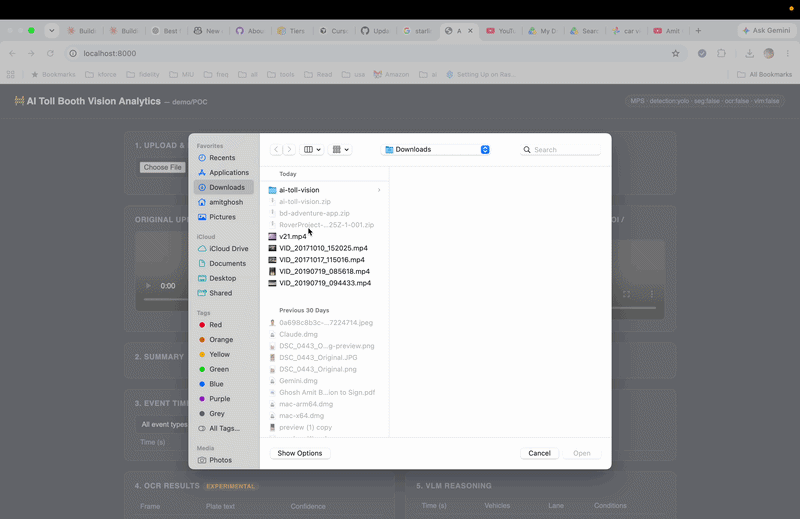

# AI Toll Booth Vision Analytics — POC

A local, single-machine proof-of-concept that analyzes toll-booth/security
camera footage with computer vision (YOLO + tracking), optional
segmentation (SAM2), optional license-plate OCR, and optional local
vision-language reasoning (Qwen2.5-VL) — producing a dashboard and
structured event data (SQLite).

**This is a demo/POC, not a production tolling or law-enforcement system.**
Every "smart" stage beyond detection+tracking is opt-in and clearly labeled
when it's not running.


---

## What it does

```
video --> frame extraction --> YOLO detection --> tracking --> ROI/lane
      --> event engine (enter/exit/etc.) --> [optional: SAM2 segmentation]
      --> [optional: plate OCR] --> [optional: VLM reasoning]
      --> SQLite --> dashboard + annotated output video
```

Only detection + tracking are required. Segmentation, OCR, and VLM
reasoning are independently toggled in `config.yaml` and the app **detects
at startup** whether the underlying packages/models are actually available
— if not, it disables that stage and says so in `/health`, rather than
faking results.

---

## Running this on your Mac

### 1. Check what you have

- **Apple Silicon (M1/M2/M3/M4)**: PyTorch uses the GPU via `mps`. This is
  the fast path — YOLOv8n detection runs comfortably in real time.
- **Intel Mac**: CPU-only. Works fine for a short demo clip at a low
  `processing_fps` (the default config uses 5 fps), just slower.

Check which you have:
```bash
uname -m
# arm64  -> Apple Silicon
# x86_64 -> Intel
```

### 2. Python version

Python 3.11+ (3.11 or 3.12 both fine). Check with `python3 --version`; if
you don't have 3.11+, install via `brew install python@3.12`.

### 3. Install system deps

```bash
brew install ffmpeg
```

### 4. Set up a virtual environment and install dependencies

```bash
cd ai-toll-vision
python3 -m venv .venv
source .venv/bin/activate

# Core (required) — torch works out of the box on Mac via plain pip, it
# ships MPS support already, no separate CPU/CUDA wheel needed like on Linux:
pip install -r requirements.txt
```

This installs: FastAPI, OpenCV, PyTorch, Ultralytics (YOLO), and test tools.
The first line of `requirements.txt` group are required; OCR/SAM2/VLM
extras are commented out — see step 6 if you want them.

YOLOv8n's weights (~6 MB) auto-download the first time you process a video.

### 5. Run it

```bash
python app.py
```

Then open **http://localhost:8000**

Or with Docker (CPU-only in the container; see `docker-compose.yml` for
notes — Docker Desktop on Mac cannot pass through the GPU/MPS, so native
`python app.py` is faster on Apple Silicon):
```bash
docker compose up --build
```

### 6. (Optional) Enable the heavier stages

Each is opt-in because they're large downloads / slower, and OCR touches
sensitive data:

| Stage | Enable in config.yaml | Extra install |
|---|---|---|
| SAM2 segmentation | `segmentation.enabled: true` | `pip install "git+https://github.com/facebookresearch/sam2.git"` + download a checkpoint |
| License plate OCR | `ocr.enabled: true` AND `ocr.plate_detector_available: true` | `pip install easyocr` (needs its own plate-region source — see Privacy section) |
| VLM reasoning | `vlm.enabled: true` | `pip install transformers accelerate qwen-vl-utils` — **Qwen2.5-VL-7B is a ~16GB download and wants a real GPU/MPS with plenty of unified memory (32GB+ recommended)**; on a smaller Mac, swap `vlm.model` in config.yaml for a smaller VLM checkpoint |

If you enable a stage but its package/model turns out to be missing or
fails to load, the app logs a warning and **skips that stage** rather than
crashing or faking output — you'll see it reflected in `GET /health`.

---

## Using it

1. Open http://localhost:8000
2. **Upload Toll Booth Video** — pick an .mp4/.avi/.mov
3. Click **Process Video** (processing time scales with video length and
   whether you're using the mock detector, YOLO-on-CPU, or YOLO-on-MPS)
4. The dashboard shows: original + annotated video side by side, vehicle
   counts by type, the event timeline (filterable by type/confidence/time),
   OCR results (if enabled), and VLM analysis (if enabled)

Where to put a test video: anywhere on your Mac — you upload it through the
web UI's file picker, it gets copied into `videos/` automatically.

### Expected output

- `outputs/{video_id}_annotated.mp4` — bounding boxes, track IDs, vehicle
  type + confidence, the lane ROI rectangle, timestamp burned in, and
  segmentation overlays if SAM2 ran
- `backend/database/toll_vision.db` — SQLite file with all events/vehicles

---

## What's currently working vs. optional

**Working out of the box (no extra downloads beyond `pip install -r requirements.txt`):**
- Video upload + metadata
- YOLOv8n vehicle detection (car/truck/bus/motorcycle)
- Multi-object tracking with persistent IDs (simple IOU tracker — see note below)
- ROI/lane definition, entering/exiting direction estimation
- Full event engine + SQLite storage
- FastAPI backend (all endpoints) + dashboard
- Annotated output video
- If `ultralytics`/`torch` somehow aren't importable, a pure-OpenCV mock
  detector keeps the whole pipeline demoable (labeled `[MOCK]` everywhere,
  never presented as a real detection)

**Optional (disabled by default, opt-in in config.yaml, each degrades gracefully if unavailable):**
- SAM2 segmentation
- License-plate OCR
- Local VLM (Qwen2.5-VL) reasoning

**Known scope cut:** tracking uses a small dependency-free IOU tracker, not
Ultralytics' bundled ByteTrack/BoT-SORT. It's swappable — call
`model.track(frame, tracker="bytetrack.yaml")` instead of `model.predict()`
in `backend/services/detector.py` if you want real ByteTrack; the IOU
tracker was chosen for the POC so tracking also works with the mock
detector and has zero extra dependencies.

---

## Hardware requirements

| | Minimum | Recommended |
|---|---|---|
| RAM | 8 GB | 16 GB+ |
| Disk | 2 GB free (core stack + YOLOv8n) | 20 GB+ if enabling VLM |
| GPU | None (CPU works) | Apple Silicon (MPS) for real-time speed |

The VLM stage specifically wants much more: Qwen2.5-VL-7B in fp16 needs
roughly 16 GB just for weights, so 32 GB unified memory (M-series Mac) or a
smaller model swap is recommended if you turn that stage on.

---

## Troubleshooting

- **`ModuleNotFoundError: ultralytics`** — you're seeing the mock detector.
  Run `pip install -r requirements.txt` inside your venv.
- **Video won't open on upload** — confirm it's actually mp4/avi/mov and
  not corrupted; OpenCV's error surfaces as a 400 response.
- **Processing is slow** — lower `video.processing_fps` in `config.yaml`
  (e.g. to 2–3), or lower `video.max_dimension`.
- **`/health` shows `device: cpu` on an M-series Mac** — confirm `torch`
  installed correctly (`python -c "import torch; print(torch.backends.mps.is_available())"`
  should print `True`); reinstall inside the venv if not.
- **Docker on Mac is slower than native** — expected; Docker Desktop can't
  access MPS. Use `python app.py` directly for GPU speed.

## Performance optimization

- Keep `processing_fps` low (5 is the default) — the pipeline samples
  frames rather than processing every one.
- SAM2 and VLM stages are frame-sampled and hard-capped
  (`segmentation.max_per_video`, `vlm.max_frames_per_video`) — they will
  never become the bottleneck even on a long video.
- Models are loaded once per server process and reused across every
  video/request.

## Privacy considerations

- License plates and faces are sensitive data. `privacy.blur_faces` and
  `privacy.blur_plates` are on by default in `config.yaml` (wire these into
  your own face/plate detector if you add one — this POC doesn't ship one).
- OCR is off by default and requires an explicit plate-region source
  (`ocr.plate_detector_available: true`) before it will run at all — it
  will not guess plate locations.
- Raw plate crops are never persisted unless you explicitly set
  `privacy.store_raw_plate_crops: true`.
- All OCR output is labeled `is_experimental` in the database and UI.

## Future improvements

- Swap in Ultralytics' ByteTrack/BoT-SORT for production-grade tracking
- Add a real license-plate detector model to unlock the OCR stage safely
- Background/async job queue for processing instead of a blocking request
- Multi-camera / multi-lane support
- Auth on the API before exposing this beyond localhost
